# 🍕 LazyPizza

[](https://opensource.org/licenses/Apache-2.0)


[](https://codecov.io/gh/amineharbaoui/lazy-pizza)
[](https://github.com/amineharbaoui/lazy-pizza/releases)


<br><br>

**LazyPizza** is a modular Android project built with the latest industry standards and best practices to demonstrate **Senior-level Android
engineering skills**:
Clean Architecture, modern Jetpack stack (Compose, Flow, Hilt), scalable multi-module setup, testing strategy, and code quality tooling.

> This is intentionally a “showcase” project: the product scope is simple, but the engineering is production-minded.

## 🚀 Tech Stack

- **Language:** [Kotlin 2.2.20](https://kotlinlang.org/)
- **UI Framework:** [Jetpack Compose](https://developer.android.com/compose) ([Material 3](https://developer.android.com/develop/ui/compose/designsystems/material3) + [Adaptive Navigation Suite](https://developer.android.com/develop/ui/compose/build-adaptive-apps))
- **Dependency Injection:** [Hilt](https://developer.android.com/training/dependency-injection/hilt-android)
- **Database:** [Room](https://developer.android.com/training/data-storage/room)
- **Auth/Backend:** [Firebase Auth](https://firebase.google.com/docs/auth) & [Firestore](https://firebase.google.com/docs/firestore)
- **Navigation:** [Navigation 3](https://developer.android.com/guide/navigation/navigation-3)
- **Image Loading:** [Coil](https://coil-kt.github.io/coil/)
- **Code Coverage:** [Kover](https://kotlin.github.io/kotlinx-kover/)
- **Static Analysis:** [Dependency Analysis](https://github.com/autonomousapps/dependency-analysis-android-gradle-plugin)

## 🎯 What this project demonstrates

### Architecture & scalability
- **Feature-based multi-module** structure
- **Clean Architecture layers:** `ui` → `domain` ← `data`
- Domain is **pure Kotlin** (no Android/framework dependencies)
- Shared `core` modules to avoid duplication and keep features focused

### 🔗 Cross-feature dependency rules

To keep features independent, replaceable, and easy to evolve, this project enforces strict cross-feature boundaries.
> Features can depend on other features only through `:domain`.
>
> Direct dependencies to another feature’s `:ui-*` or `:data` are forbidden to avoid coupling.

```mermaid
graph TB
   subgraph CROSS_RULES ["🔗 Cross-Feature Rules"]
        direction LR

        subgraph FA["Feature A"]
            direction TB
            FA_UI[":ui 🟠"]
            FA_DOMAIN[":domain 🟣"]
            FA_DATA[":data 🔵"]
        end

        subgraph FB["Feature B"]
            direction TB
            FB_UI[":ui 🟠"]
            FB_DOMAIN[":domain 🟣"]
            FB_DATA[":data 🔵"]
        end
    end

%% ✅ Allowed: any layer -> other feature :domain
    FA_UI -->|"✅ allowed"| FB_DOMAIN
    FA_DOMAIN -->|"✅ allowed"| FB_DOMAIN
    FA_DATA -->|"✅ allowed"| FB_DOMAIN

%% ❌ Forbidden: any layer -> other feature :data
    FA_UI -.->|"❌ FORBIDDEN"| FB_UI
    FA_UI -.->|"❌ FORBIDDEN"| FB_DATA
    FA_DOMAIN -.->|"❌ FORBIDDEN"| FB_DATA
    FA_DATA -.->|"❌ FORBIDDEN"| FB_DATA
```


### 🧱 Feature module layering (UI → Domain ← Data)

Each feature in the project is split into dedicated modules to enforce a clear separation of concerns and keep dependencies pointing in one direction:
- UI (`:ui-*`) renders state and forwards user actions via the ViewModel.
- Domain (`:domain`) holds the business logic: use cases + repository contracts (pure Kotlin).
- Data (`:data`) implements the domain contracts using real sources (Firebase / Room) and maps data models to domain models.

This makes features easier to test, maintain, and scale as the project grows.

```mermaid
graph TB

subgraph FEATURE ["📦 :features:<feature_name>"]
direction TB

  subgraph UI ["🟡 :ui-*"]
  direction TB
  SCREEN["Screen"]
  VM["ViewModel"]
  UI_STATE["UiState · UiActions "]

  SCREEN --> |"Observes"| UI_STATE
  VM --> |"Updates"| UI_STATE
  end

  subgraph DOMAIN ["🟣 :domain — Pure Kotlin"]
  direction TB
  UC["Use Cases<br/><i>(Business logic)</i>"]
  REPO_IF["Repository Interfaces"]

  UC -->|"Uses"|REPO_IF
  end

  subgraph DATA ["🔵 :data"]
  direction TB
  REPO_IMPL["Repository Impl"]
  MAPPER["Mapper <br/> DataModel → DomainModel"]
  DS_REMOTE["Remote DataSource"]
  DS_LOCAL["Local DataSource"]

  subgraph PLATFORM ["🧩 Platform deps"]
  direction LR
  FIREBASE["Firebase"]
  ROOM["Room"]
  end

  REPO_IMPL -->|"Uses"| MAPPER
  REPO_IMPL -->|"Uses"| DS_REMOTE -->|"Uses"| FIREBASE
  REPO_IMPL -->|"Uses"| DS_LOCAL -->|"Uses"| ROOM

  REPO_IMPL -.->|"Implements"| REPO_IF
  end
end

VM -->|"Uses"| UC

```


## 🚦 Getting Started

1. **Prerequisites:**
    - Android Studio
    - JDK 17+

2. **Clone & Run:**
    ```bash
    git clone https://github.com/amineharbaoui/lazy-pizza.git
    cd LazyPizza
    ```
    - Open in Android Studio
    - Sync Gradle
    - Run on emulator or device

> A shared development `google-services.json` is included in the repo — no Firebase setup needed.
> If you want to use your own Firebase project, replace `app/google-services.json` with yours
> (enable **Authentication** and **Cloud Firestore**).

> [!NOTE]
> 🔐 **Demo login:** Phone verification code is **111111**
>
## 📦 Modules

| Module | Description |
|--------|-------------|
| `:app` | Application entry point, Hilt setup, navigation graph |
| `:core:designsystem` | Shared Compose components, theme, colors |
| `:core:ui` | Shared UI utilities |
| `:core:model` | Shared domain models |
| `:core:common` | Shared utilities |
| `:core:network` | Network/Firebase utilities |
| `:core:testing` | Test utilities and fixtures |
| `:features:menu:*` | Pizza menu browsing (home + detail) |
| `:features:cart:*` | Shopping cart management |
| `:features:auth:*` | Authentication (login) |
| `:features:order:*` | Checkout + order history |

## 🧪 Testing & Quality

```bash
./gradlew test                  # Run unit tests
./gradlew koverHtmlReport       # Generate coverage report
./gradlew buildHealth           # Dependency analysis
```

This project follows a strict unit testing style:

- **BDD structure**: `Given / When / Then`
- **Single concern per test** (one outcome per test method)
- **Isolated & deterministic** (no network/db/filesystem, no delays, no randomness)
- **Assertions**: AssertJ only
- **Flow testing**: Turbine
- **Mocking**: MockK in **BDD style** (`given/coGiven/then/coThen`)

## 🔧 Build Logic

Custom Gradle convention plugins in `build-logic/convention/`:

| Plugin | What it does |
|--------|-------------|
| custom-android-application | Configures the Android app module (SDK versions, Java/Kotlin 17, R8 shrinking) |
| custom-android-module | Configures Android library modules (SDK versions, Java/Kotlin 17) |
| custom-kotlin-module | Configures pure-Kotlin modules (JVM 17) |
| custom-compose | Enables Jetpack Compose with BOM-aligned Material 3 + Adaptive dependencies |
| custom-hilt | Applies Hilt + KSP for dependency injection |
| custom-room | Applies Room + KSP with schema export configuration |
| custom-testing | Adds test dependencies (JUnit 5, MockK BDD, AssertJ, Turbine, Coroutines Test) |
| custom-code-coverage | Configures Kover for HTML + XML coverage reports |

## 🗺 TODOs

### CI/CD (GitHub Actions)
- [ ] Run unit tests on PRs
- [ ] Generate Kover coverage report + upload as artifact
- [ ] Assemble debug/release builds
### Code quality
- [ ] Add **Detekt** for static analysis
- [ ] Add **Ktlint** for formatting + auto-fix
### Testing
- [ ] Expand unit tests across all modules
- [ ] Add **UI tests** for key flows (menu → detail → cart → checkout)
### UI/UX
- [ ] Add Dark Mode


## 📄 License
```
Copyright 2025 amineharbaoui

Licensed under the Apache License, Version 2.0 (the "License");
you may not use this project except in compliance with the License.
You may obtain a copy of the License at

http://www.apache.org/licenses/LICENSE-2.0

Unless required by applicable law or agreed to in writing, software
distributed under the License is distributed on an "AS IS" BASIS,
WITHOUT WARRANTIES OR CONDITIONS OF ANY KIND, either express or implied.
See the License for the specific language governing permissions and
limitations under the License.
```
